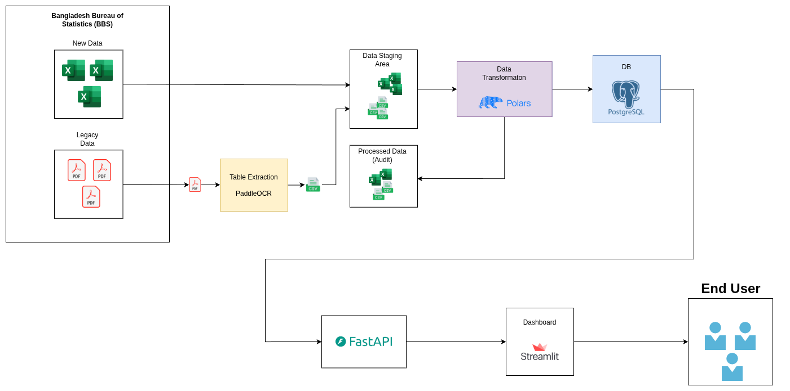
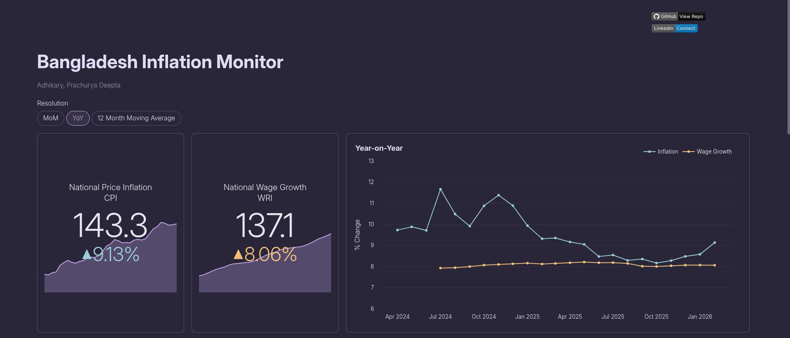
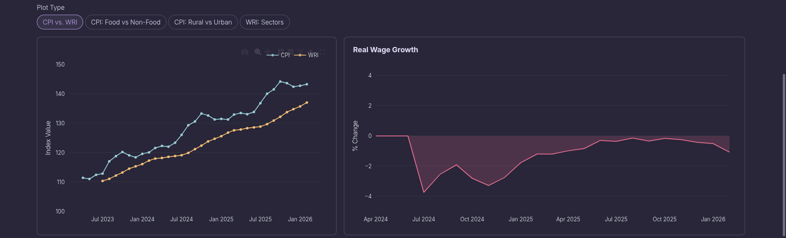
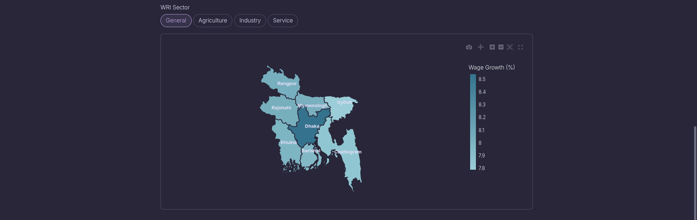

# Bangladesh Inflation Monitor

This dashboard visualizes Bangladesh's economic situation using a data-driven
approach to answer the question: Are people in Bangladesh, on average, getting
richer or poorer?

## Data Flow Diagram

The data for this dashboard is sourced from [Bangladesh Bureau of Statistics](https://bbs.gov.bd/pages/static-pages/6922de7a933eb65569e1ae8f).

## About the Dashboard

- Displays current CPI, inflation, WRI, and wage growth
- Visualizes trends in inflation vs wage growth over time
- Provides a quick snapshot of overall economic conditions

- CPI: Food vs non-food comparison
- Regional CPI: Rural vs urban trends
- Wage growth across:
  - Agriculture
  - Industry
  - Services
- Real wage growth (wage growth − inflation)
- Remains negative over time
- Indicates declining purchasing power

- Choropleth map of wage growth across Bangladesh’s divisions
- Highlights regional economic disparities

Key insights:

- Dhaka leads in the industrial sector (industrial hub)
- Mymensingh leads in agriculture (major crop production)
- Chattogram leads in services (major port and trade hub)

The data suggests that people in Bangladesh are, on average, still not getting
richer. While wages have increased over time, inflation has generally outpaced
wage growth, resulting in negative real wage growth. However, the gap between
wage growth and inflation has been narrowing, meaning real wage growth is gradually
moving closer to zero. This indicates a slow improvement in purchasing power,
but it has not yet turned positive.
